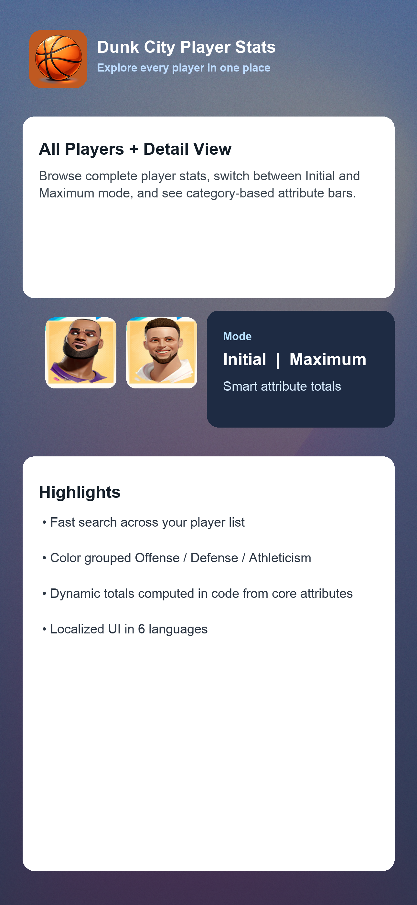
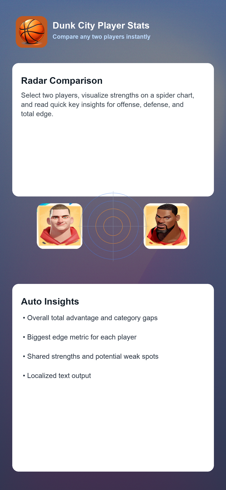
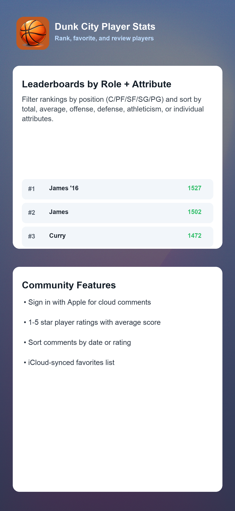

# Dunk City Player Stats (iOS)

An iPhone app for browsing and comparing **Dunk City Mobile** player attributes.

## Features

- **All Players Stats** list with search and per-player detail pages.
- **Compare Players** view with radar chart and auto-generated key insights.
- **Rank Players** with two selectors:
  - by **role** (`C`, `PF`, `SF`, `SG`, `PG`, or All)
  - by **metric** (`Total`, `Avg`, `Offense`, `Defense`, `Athleticism`, and each core attribute)
- **Mode switch** on Home: `Initial` vs `Maximum` stats.
- **Player detail bars** with category grouping/coloring:
  - Offense (orange)
  - Defense (blue)
  - Athleticism (green)
- **Favorites** synced with iCloud (CloudKit).
- **Ratings & comments** (1-5 stars) with sorting by date/rating.
- **Sign in with Apple** required for cloud comment/favorite actions.
- **Localization** support: English, Spanish, French, Chinese (Simplified), Japanese, Korean.

## App Store-Style Screenshots

### 1) Roster & Player Details



### 2) Player Comparison



### 3) Rankings, Favorites, and Comments



## Tech Stack

- Swift + SwiftUI
- CloudKit (public database)
- Sign in with Apple
- CSV-backed player data (`DunkCityStats.csv`)

## Repository Structure

- `DunkCityStats/` - app source code, assets, localization, CSV data
- `DunkCityStats.xcodeproj/` - Xcode project
- `DunkCityStatsTests/` - unit tests
- `DunkCityStatsUITests/` - UI tests
- `privacy.html` - privacy policy page (GitHub Pages ready)
- `scripts_sync_online_stats.py` - optional stats sync script from fandom wiki
- `DunkCityStats/tools/extract_download_headshots.py` - headshot extraction helper

## Getting Started

### 1. Open the project

```bash
cd /Users/zzuo1/Documents/DunkCityStats
open DunkCityStats.xcodeproj
```

### 2. Configure signing

In Xcode:

1. Select the blue project icon `DunkCityStats` in the navigator.
2. Under **TARGETS**, select `DunkCityStats`.
3. Open **Signing & Capabilities**.
4. Set your Apple Developer **Team**.
5. Confirm Bundle Identifier (current: `zz.DunkCityStats`).

### 3. Enable required capabilities

Add/confirm these capabilities on the app target:

- **Sign in with Apple**
- **iCloud**
  - Check **CloudKit**
  - Ensure the container exists and is selected:
    - `iCloud.zz.DunkCityStats` (or `iCloud.<your bundle id>` if you changed bundle id)

### 4. Run

Choose an iPhone simulator/device and Run.

## CloudKit Setup Notes

If you see an error like:

- `unknown container: 'iCloud.zz.DunkCityStats'`

it means the CloudKit container is not fully provisioned yet.

### Fix checklist

1. Xcode `Signing & Capabilities` has **iCloud + CloudKit** enabled.
2. Apple Developer portal app ID has iCloud/CloudKit enabled.
3. CloudKit container exists and is linked to your app ID.
4. For TestFlight/App Store builds: deploy CloudKit schema from **Development** to **Production** in CloudKit Dashboard.

## Data Model (CSV)

Primary data file:

- `DunkCityStats/DunkCityStats.csv`

Current CSV uses separate init/max columns. Example header pattern:

- `Player, Position, Dunk Max, Dunk Init, ... Strength Max, Strength Init`

Derived values (`Total`, `Avg`, `Offense`, `Defense`, `Athleticism`) are calculated in code from core attributes.

## Updating Stats Data

Optional script to sync stats from fandom wiki:

```bash
python3 scripts_sync_online_stats.py --csv DunkCityStats/DunkCityStats.csv --mode max --inplace
python3 scripts_sync_online_stats.py --csv DunkCityStats/DunkCityStats.csv --mode init --inplace
```

Script outputs a JSON report of updated/missing players.

## Headshots

Player headshots are mapped in code (`Player.headshotURLByName`) and loaded with `AsyncImage`.

## Privacy Policy

- Local file: `privacy.html`
- You can host it with GitHub Pages and use the published URL in App Store Connect.

## Disclaimer

This is a fan-made stats companion app. Dunk City Mobile and related assets/trademarks belong to their respective owners.
